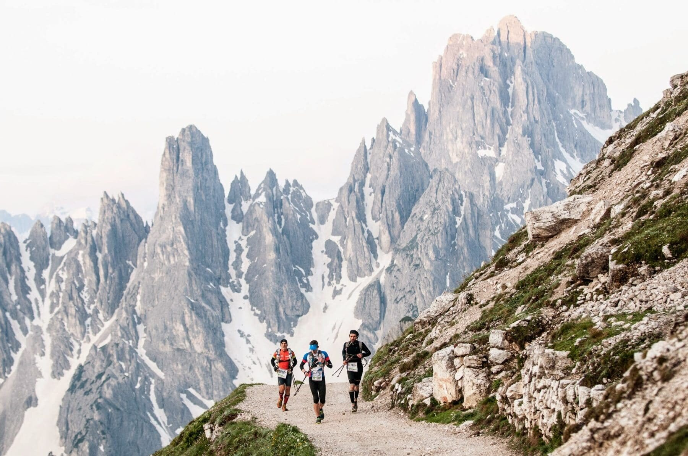

Le trail running est la pratique de la course à pied en pleine nature. C'est un sport hors stade très complet qui sollicite les jambes certes mais également le haut du corps. Il demande beacoup de concentration, prudence et endurance. 

La base de données qui a servi de base à cette étude contient des informations de l'International Trail Running Association sur des trails de différentes distances (de 33.3 à 179 km) organisées dans le monde de 2012 à 2021. 

Dans ce travail, nous allons nous concentrer sur **l'ultra trail running**. Ce terme est généralement utilisé pour les distances supérieures à 80 km. Nous essaierons d'identifier les tendances de l'ultra trail au cours des 10 dernières années et de répondre aux questions suivantes:

* Quel est le profil du coureur d'ultra trail typique (âge, sexe) ? Qui a le plus de chances de réussir dans ce sport?

* Dans quels pays ce sport est-il le plus développé et populaire? Comment la popularité de ce sport a-t-elle évolué au fil du temps?

* Qu'est-ce qui est le plus populaire: les courses en équipe ou les courses individuelles?

* Est-il vrai que les événements d'ultra trail sont généralement organisés dans les hautes terres?

* Qu'est-ce qui détermine le nombre de points d'assistance sur la piste ?

```{r, echo=FALSE, results='hide', message=FALSE}
# Chargement des données et des bibliothèques

library(tidyverse)
library(dplyr)

ultra_rankings <- readr::read_csv('https://raw.githubusercontent.com/rfordatascience/tidytuesday/master/data/2021/2021-10-26/ultra_rankings.csv')
race <- readr::read_csv('https://raw.githubusercontent.com/rfordatascience/tidytuesday/master/data/2021/2021-10-26/race.csv')
utr <- merge(x = ultra_rankings, y = race, by = 'race_year_id')
```

```{r, echo=FALSE, results='hide', message=FALSE}
# Nettoyage des données

# Supprimons les colonnes inutiles pour notre analyse
utr[ ,c('time', 'event', 'city', 'start_time', 'race_year_id', 'elevation_loss')] <- list(NULL)

# Faison summary pour identifier les problèmes de données possibles
summary(utr)

# Supprimons les lignes avec des valeurs manquantes ou nulles afin qu'elles ne faussent pas l'analyse des données
utr <- na.omit(utr)
utr <- utr %>% filter_at(vars(age, distance, elevation_gain, aid_stations, participants), all_vars(. > 0))

# Il est douteux que l'âge du participant de l'ultra trail soit supérieur à 100 - supprimons telles valeurs
utr <- utr %>% filter(age <= 100)

# Réduisson la date de trail à un an (nous n'avons pas besoin d'une date plus détaillée pour l'analyse)
utr$date <- utr$date %>% format(format ='%Y')
```


```{r, echo = FALSE, results='hide', message=FALSE}
# Voilà la table optimale pour l'analyse:
head(utr)
```

## Quel est le profil du coureur d'ultra trail? 

- **Quel est l'âge typique des coureurs d'ultra trail?**

L'âge moyen d'un participant de l'ultra trail est **45 ans**, et la moitié de tous les participants sont dans la catégorie d'âge **39-51**. 
Il est intéressant que seulement **0,3%** des coureurs ont moins de 25 ans, tandis que le pourcentage de coureurs de plus de 60 ans est **4%**.

```{r, echo = FALSE}
summary(utr$age)

young <- utr %>% filter(age < 25)
young_pct <- round(nrow(young)/nrow(utr)*100, 1)
old <- utr %>% filter(age > 60)
old_pct <- round(nrow(old)/nrow(utr)*100, 1)

cat("Pourcentage de coureurs de moins de 25 ans:", young_pct, "% 
Pourcentage de coureurs de plus de 60 ans:", old_pct, "%")
```
```{r}
age <- ggplot(utr, aes(x = age)) +
  geom_boxplot(color="dark green", fill="light green", alpha=0.2) +
  theme_classic()
age
```

- **Est-ce que plus d'hommes ou de femmes participent aux trails de plus de 80 km? Comment la composition par gender des races change-t-elle au fil du temps ?**

Traditionnellement, en raison de la difficulté de courir sur de telles distances, il y a beaucoup plus d'hommes que de femmes sur les ultra trails. En moyenne sur l'ensemble des années, seuls **16%** des coureurs sont des femmes. 

De plus, il est à noter que cette tendance n'a pas changé au fil des ans et que le pourcentage de femmes parmi les participants à l'ultra trail demeure à peu près au même niveau (sauf en 2014, où, pour une raison quelconque, le pourcentage de femmes était beaucoup plus élevé et était de 25 %). Tout de même, l'ultra trail est un sport pour les plus forts et les plus endurants et souvent au-delà du pouvoir des filles!

```{r, warning=FALSE, message=FALSE}
utr %>% 
  group_by(date, gender) %>% 
  summarise(n = n()) %>% 
  ggplot(aes(date, n , fill = gender)) +
  scale_fill_brewer(palette="Green") +
  geom_bar(stat = "identity", width = 1, color = 'black', position = position_stack(reverse = TRUE)) +
  ggtitle("Composition par gender des ultra trails par année") +
  theme_minimal()

women_growth <- utr %>% 
  group_by(date, gender) %>% 
  summarise(n = n()) %>% 
  pivot_wider(names_from = gender, values_from = n) %>% 
  mutate(women_pct = round((W / (W + M)) * 100,1))
  
women_growth %>% 
  ggplot() + 
  geom_bar(aes(x = date, y = women_pct), stat = "identity", fill = "light green", color = "light green") +
  geom_line(aes(x = date, y = women_pct), stat="identity", color = "dark green", group = 1) +
  geom_text(aes(label = women_pct, x = date, y = women_pct), color="dark green", vjust = -0.5) +
  ggtitle("Pourcentage de femmes participant à des ultra trails par année") +
  theme_minimal() 
```

- **Qui a le plus de chances de réussir dans ce sport?**

Il semble qu'un **homme de 35-46** ans ait les meilleures chances de gagner un trail sur une distance de plus de 80 km. Pas étonnant!

```{r, warnings = FALSE, echo = FALSE, message = FALSE}
winners <- utr %>% 
  filter(rank == c(1,2,3))

winners %>% 
  ggplot(aes(x = age)) + 
  geom_histogram(aes(y =..density..), colour="black", fill="white") +
  geom_density(alpha=.2, fill="light green") +
  ggtitle("Âge des meilleurs coureurs") +
  theme_minimal()
```

```{r, warning=FALSE}
winners_gender <- winners %>% 
  group_by(gender) %>% 
  dplyr::summarise(n = n()) %>% 
  pivot_wider(names_from = gender, values_from = n) %>% 
  mutate(women_pct = round((W / (W + M)) * 100,1)) %>% 
  mutate(men_pct = round((M / (W + M)) * 100,1))

winners_gender <- winners %>% 
  group_by(gender) %>% 
  dplyr::summarise(n = n())

winners_gender %>% 
  ggplot(aes(x = "", y = n, fill = gender)) +
  geom_bar(stat = "identity", width = 1) +
  coord_polar("y", start = 0) +
  theme_void() +
  scale_fill_brewer(palette="Green") +
  geom_text(aes(label = n, vjust = 0.5, hjust = 1.2), color = "dark green", size=4) +
  ggtitle("Le nombre de femmes et d'hommes parmi les lauréats des trails")
```
```{r}
winners %>% 
  ggplot(aes(x = runner, y = age, color = gender)) +
  geom_point(size = 3, alpha = 0.5) +
  scale_color_manual(values = c("light green", "dark green")) +
  ggtitle("Profil du gagnant : âge et sexe") +
  theme(axis.text.x=element_blank())
```

## Dans quels pays ce sport est-il le plus développé et populaire? Comment la popularité de ce sport a-t-elle évolué au fil du temps?

Au total,  de 2012 à 2021, des athlètes de **120 nationalités** ont participé aux ultra trails organisées dans **50 pays** différents.

```{r, echo=FALSE, results='hide'}
nationality <- utr %>% 
  group_by(nationality) %>% 
  summarise(n = n()) %>% 
  arrange(desc(n))
nrow(nationality)
```

```{r, echo=FALSE, results='hide'}
country <- utr %>% 
  group_by(country) %>% 
  summarise(n = n()) %>% 
  arrange(desc(n))
nrow(country)
```

- **De quels pays viennent le plus de coureurs?**

Le plus grand nombre de coureurs viennet des **États-Unis**, de la **France** et du **Royaume-Uni**. Au total, ils représentent **plus de la moitié** de tous les participants aux ultra trails. Il y a aussi beaucoup d'athlètes de Chine, d'Espagne, du Japon, de Suède, d'Italie, de Russie et du Canada.

```{r, message=FALSE}
nationality <- nationality %>% 
  mutate(percentage = round(n / sum(n) * 100, 1)) %>% 
  top_n(10)

nationality %>%
  mutate(nationality = factor(nationality, nationality)) %>%
  ggplot(aes(x = nationality, y = n, size = n, color = nationality)) +
    geom_point(alpha = 0.8) +
    scale_size(range = c(.1, 24), name="Nombre de coureurs") +
    theme(legend.position = "none") +
    ylab("nombre de courreurs") +
    ylim(0, 15000) +
    geom_text(aes(label = n, vjust = 0.5), color = "black", size=2.5) +
    ggtitle("Top 10 des nationalités des participants aux ultra trails") +
    theme(panel.background = element_rect(fill = "white", colour = "light grey", size = 2, linetype = "solid"),
    panel.grid.major = element_line(size = 0.5, linetype = 'solid', colour = "light grey"), 
    panel.grid.minor = element_line(size = 0.25, linetype = 'solid', colour = "light grey"))
```
```{r, warning=FALSE, message=FALSE}
library(wordcloud)
library(reshape)
library(tm)

text <- utr$nationality
docs <- Corpus(VectorSource(text))
dtm <- TermDocumentMatrix(docs) 
matrix <- as.matrix(dtm) 
words <- sort(rowSums(matrix),decreasing = TRUE) 
df <- data.frame(word = names(words),freq = words)
set.seed(1234) 
wordcloud(words = df$word, freq = df$freq, min.freq = 1, max.words = 200, 
          random.order = FALSE, rot.per = 0.5, colors = brewer.pal(20, "Dark2"), 
          scale = c(2,2))
```

- **Dans quels pays le plus de trails sont-ils organisés?**

La plupart des événements d'ultra trail se déroulent en **France**, aux **États-Unis** et au **Royaume-Uni**. Ensemble, ils représentent près de **76%** de toutes les races. Il y a aussi beaucoup d'événements en Chine, en Espagne,au Japon, en Suède, en Suisse, en Nouvelle-Zélande et en Argentine.

```{r, message=FALSE}
country <- country%>% 
  mutate(percentage = round(n / sum(n) * 100, 1)) %>% 
  top_n(10)

library(viridis)
country %>%
  mutate(country= factor(country, country)) %>%
  ggplot(aes(x = country, y = n, size = n, color = country)) +
    geom_point(alpha = 0.8) +
    scale_size(range = c(.1, 24), name="Nombre d'événements") +
    theme(legend.position = "none") +
    ylab("nombre d'événements") +
    ylim(0, 20000) +
    geom_text(aes(label = n, vjust = 0.5), color = "black", size=2.5) +
    ggtitle("Top 10 pays avec le plus d'événements d'ultra trail") +
    theme(axis.text.x = element_text(size=8, angle=45, hjust = 1)) +
    theme(panel.background = element_rect(fill = "white", colour = "light grey", size = 2, linetype = "solid"),
    panel.grid.major = element_line(size = 0.5, linetype = 'solid', colour = "light grey"), 
    panel.grid.minor = element_line(size = 0.25, linetype = 'solid', colour = "light grey"))
```
```{r, echo=FALSE,message=FALSE}
ultra_rankings <- readr::read_csv('https://raw.githubusercontent.com/rfordatascience/tidytuesday/master/data/2021/2021-10-26/ultra_rankings.csv')
race <- readr::read_csv('https://raw.githubusercontent.com/rfordatascience/tidytuesday/master/data/2021/2021-10-26/race.csv')
utr1 <- merge(x = ultra_rankings, y = race, by = 'race_year_id')

city <- utr1 %>% 
  select(city, race) %>%  
  group_by(city) %>% 
  dplyr::summarise(n = n())
city$name <- city$city
city$city <- NULL
```


```{r, message=FALSE}
library(maps)
world <- map_data("world")
data <- world.cities
map <- merge(data, city)

ggplot() +
  geom_polygon(data = world, aes(x = long, y = lat, group = group), fill = "light green", alpha = 0.5) +
  geom_point( data = map, aes(x = long, y = lat, color = n, size = n, alpha = 0.7)) +
  scale_size_continuous(range = c(1,12)) +
  scale_color_viridis() +
  ggtitle("Géographie des courses d'Ultra Trail de 2012 à 2021")+
  theme_bw(base_size = 8) +
  guides(colour = guide_legend()) +
  ylim(-50,100) +
  coord_map() +
  theme_classic()
```


- **Comment la popularité de ce sport a-t-elle évolué au fil du temps?**

De 2012 à 2019, la popularité de l'Ultra Trail Running a augmenté à un rythme impressionnant. Ainsi, depuis 8 ans, le nombre annuel de participants aux trails a **multiplié par près de 60**!
Cependant, en 2020, il y a eu une forte baisse associée à la pandémie de coronavirus et aux restrictions sur les événements publics, ainsi que les voyages internationaux.

```{r}
utr %>% 
  group_by(date) %>% 
  dplyr::summarise(n = n()) %>% 
  ggplot(aes(date, n)) +
  geom_bar(stat = "identity", width = 1, color = 'dark green', fill = 'light green', position = position_stack(reverse = TRUE)) +
  geom_line(color = "black", group = 1) +
  ggtitle("Le nombre d'athlètes ayant participé aux ultra trails par année") +
  geom_text(aes(label = n, vjust = -0.5), color = "dark green", size = 3) +
  theme_minimal()
```

# Qu'est-ce qui détermine la popularité de l'ultra trail, à l'exception de l'année (distance, niveau de dénivelé, pays, course) ?

Les calculs montrent qu'il existe vraiment une relation entre la popularité du trail et la distance et le niveau d'élévation. Il est à noter que moins d'athlètes participent aux courses les plus longues et avec des montées les plus longues. Il n'est pas difficile de se laisser intimider par la course de 170 km avec un dénivelé de 14 000 mètres !

```{r}
popularity <- utr %>% 
  select(participants, distance, elevation_gain)

pop_cor <- cor(popularity)

library(corrplot)
col <- colorRampPalette(c("white", "light green", "dark green"))(20)
corrplot(pop_cor, method = 'number', type = "upper", order = "hclust", tl.col = "black", tl.srt=45, col = col)
```

```{r, warning=FALSE}
popularity %>% 
  ggplot(aes(participants, distance, color = participants)) +
  geom_point() +
  scale_color_gradient(low = "light green", high = "dark green") +
  ylim(150,180) +
  theme_minimal()

popularity %>% 
  ggplot(aes(participants, elevation_gain, color = participants)) +
  geom_point() +
  scale_color_gradient(low = "light green", high = "dark green") +
  theme_minimal()
```
```{r, message=FALSE}
# La régression linéaire confirme également l'importance de la distance et du niveau de montée et leur impact sur la popularité de la course
library(broom)
reg <- utr %>% 
  lm(participants ~ distance + elevation_gain, data = .) 
df <- tidy(reg)
library(kableExtra)
df %>%
  kbl() %>%
  kable_styling()
```

Aussi, la popularité des ultra trails dépend certainement du pays (il est difficile et financièrement cher de se rendre dans certains pays) et de la course (certaines événement sont bien sûr plus prestigieuses que d'autres).

```{r, message=FALSE}
utr %>% 
  select(race, participants) %>% 
  group_by(race) %>% 
  dplyr::summarise(n = n()) %>%
  top_n(50) %>% 
  mutate(race = fct_reorder(race, desc(n))) %>%
  ggplot(aes(x = race, y = n)) +
  geom_bar(stat = "identity", width = 0.5, color = 'dark green', fill = 'light green', 
           position = position_stack(reverse = TRUE)) +
  coord_flip() +
  geom_text(aes(label = n, hjust = -0.5), color = "dark green", size = 2) +
  ggtitle("Le nombre de participants par race") +
  theme_classic(base_size = 8)
```
```{r}
utr %>% 
  select(country, participants) %>% 
  group_by(country) %>% 
  dplyr::summarise(n = n()) %>%
  mutate(country = fct_reorder(country, desc(n))) %>%
  ggplot(aes(x = country, y = n)) +
  geom_bar(stat = "identity", width = 0.5, color = 'dark green', fill = 'light green', 
           position = position_stack(reverse = TRUE)) +
  coord_flip() +
  geom_text(aes(label = n, hjust = -0.5), color = "dark green", size = 2) +
  ggtitle("Le nombre de participants par pays") +
  theme_classic(base_size = 8)
```


## Qu'est-ce qui est plus populaire: les courses en équipe ou les courses individuelles?

Les trails individuels sont plus populaires. Les compétitions d'ultra trail par équipene représentent que **0,3%** du total. 
De plus, les compétitions par équipes n'ont pas lieu chaque année.

```{r}
utr %>% 
  select(race, participation) %>% 
  group_by(participation) %>% 
  dplyr::summarise(n = n()) %>% 
  pivot_wider(names_from = participation, values_from = n) %>% 
  mutate(solo = solo + Solo) %>% 
  select(solo, team) %>% 
  pivot_longer(everything(), names_to = "type", values_to = "n")  %>% 
  ggplot(aes(x = "", y = type, fill = type))+
  geom_col(fill = c("light green", "dark green")) +
  geom_text(aes(label = n, vjust = -2), color = "white", size = 4) +
  ggtitle("Nombre de trails individuelles et par équipes") +
  theme_minimal()

```

```{r, message=FALSE}
utr %>% 
  filter(participation == "team") %>% 
  select(date, participation, race) %>% 
  group_by(date, participation) %>% 
  dplyr::summarise(n = n()) %>% 
  ggplot(aes(date, n, fill = n)) +
  geom_bar(stat="identity")+
  scale_fill_gradient(low = "light green", high = "dark green") +
  ggtitle("Nombre de trails en équipes par année") +
  theme_minimal()
```

## Est-il vrai que les événements d'ultra trail sont généralement organisés dans les hautes terres?

L'Ultra Trail Running peut se dérouler sur des terrains très différents : dans notre base de données, il y a des courses presque "à plat" et des courses avec une ascension allant jusqu'à 14,5 mille mètres. Cependant, plus de courses ont lieu dans les zones montagneuses. La montée moyenne pour une course est de **6676 mètres**, et il y a aussi une très forte augmentation du nombre de courses avec une ascension de l'ordre de **10 000 mètres**. Si vous souhaitez participer à l'ultra trail, préparez-vous à conquérir les sommets!

```{r, message=FALSE, warning=FALSE}
summary(utr$elevation_gain)

utr %>% 
  ggplot(aes(x = elevation_gain)) + 
  geom_histogram(aes(y =..density..), colour="black", fill="white") +
  geom_density(alpha=.2, fill="light green") +
  theme_minimal()
```


##  Qu'est-ce qui détermine le nombre de points d'assistance sur la piste ?

Il est de bon sens que le nombre de postes d'assistance le long du parcours d'une course peut dépendre de la distance et de la topographie de la piste, ainsi que du nombre de participants. Regardons ça!

```{r, message=FALSE}
aid_stations <- utr %>% 
  select(aid_stations, distance, elevation_gain, participants)

aid_cor <- cor(aid_stations)

col<- colorRampPalette(c("white", "light green", "dark green"))(20)
corrplot(aid_cor, method = 'number', type = "upper", order = "hclust", tl.col = "black", tl.srt=45, col = col)
```

Bien qu'à en juger par les calculs, il existe une corrélation entre le nombre de points d'assistance et la distance, le relief et le nombre de participants, on peut voir sur les diagrammes de dispersion que cela est plus probablement dû à des valeurs aberrantes, mais en fait l'influence de ces variables sur le nombre de points d'aide n'est pas grande.

```{r, message=FALSE}
plot1 <- aid_stations %>% 
  ggplot(aes(aid_stations, distance, color = aid_stations)) +
  geom_point() +
  scale_color_gradient(low = "light green", high = "dark green") +
  theme_minimal()

plot2 <- aid_stations %>% 
  ggplot(aes(aid_stations, elevation_gain, color = aid_stations)) +
  geom_point() +
  scale_color_gradient(low = "light green", high = "dark green") +
  theme_minimal()

plot3 <- aid_stations %>% 
  ggplot(aes(aid_stations, participants, color = aid_stations)) +
  geom_point() +
  scale_color_gradient(low = "light green", high = "dark green") +
  theme_minimal()

library(cowplot)
plot_grid(plot1, plot2, plot3, 
          labels = c("A", "B", "C"),
          ncol = 2, nrow = 2)
```

```{r}
# La régression linéaire confirme également l'importance de la distance, du niveau de montée et du numbre des participants et leur impact sur la popularité de la course
reg <- utr %>% 
  lm( aid_stations ~ distance + elevation_gain + participants, data = .) 
df <- tidy(reg)
df %>%
  kbl() %>%
  kable_styling()
```


Cependant, on peut voir sur le graphique ci-dessous que le nombre de postes d'assistance varie considérablement entre les différentes trails. Probablement, leur nombre dépend de nombreux autres facteurs non pris en compte dans notre base de données (par exemple, l'organisateur du trail, la complexité du parcours, la géographie, le climat et les conditions météorologiques).

```{r, message=FALSE}
utr %>% 
  select(race, aid_stations) %>% 
  group_by(race) %>% 
  dplyr::summarise(n = n()) %>%
  top_n(50) %>% 
  mutate(race = fct_reorder(race, desc(n))) %>%
  ggplot(aes(x = race, y = n)) +
  geom_bar(stat = "identity", width = 0.5, color = 'dark green', fill = 'light green', 
           position = position_stack(reverse = TRUE)) +
  coord_flip() +
  geom_text(aes(label = n, hjust = -0.5), color = "dark green", size = 2) +
  ggtitle("Le nombre de postes d'assistance par race") +
  theme_classic(base_size = 8)
```


# Section par Paolo Crosetto

## Questions additionnelles

### 1. Profil du gagnant: âge et sexe

Je ne compprends pas ce que ce plot veut dire -- quel est son message? Pourquoi l'afficher? Vous avez déjà montré l'âge et le sexe avant. Pourquoi croiser les deux? Si vous voulez faire des comparaisons d'age par sexe il serait mieux de faire des distributions, par exemple des distributions cumulative de l'âge par sexe. Voilà, question: y a-t-il une différence dans la distribution des âges des femmes et des hommes? Montrez cela avec une CDF, pour les participants en général et pour les gagnants en particulier. Sur un seul plot.  


```{r}
plot1 <- utr %>% 
  ggplot(aes(x = age, colour = gender)) +
  stat_ecdf(geom = "step", pad = FALSE) +
  scale_color_manual(values = c("dark green", "light green")) +
  ggtitle("La distribution cumulative de l'age de tous les participants") +
  theme_minimal(base_size = 10)
plot2 <- winners %>% 
  ggplot(aes(x = age, colour = gender)) +
  stat_ecdf(geom = "step", pad = FALSE) +
  scale_color_manual(values = c("dark green", "light green")) +
  ggtitle("La distribution cumulative de l'age des gagnants") +
  theme_minimal(base_size = 10)
library(cowplot)
plot_grid(plot1, plot2, ncol = 1, nrow = 2)
```

À partir de ces graphiques, on peut voir la tendance générale selon laquelle les femmes sparticipant aux les ultra trails sont, en moyenne, légèrement plus jeunes que les hommes. Cette différence est plus visible parmi les gagnants, surtout dans la zone de 39-59 ans. Pourtant, en general, la distribution des âges des femmes et des hommes n'est pas très différente.

### 2. Courses équipe vs individuel

Il faut refaire ce plot, parce qu'il est mauvais: il n'est pas possible que 163 soit plus ou moins un tiers de 55463! Faites un plot qui reflète vraiment les proportions que vous avez trouvé. 


```{r, message=FALSE}
type <- utr %>% 
  select(race, participation, runner) %>% 
  group_by(race, participation) %>% 
  dplyr::summarise(n = n()) %>% 
  pivot_wider(names_from = participation, values_from = n) 
type[is.na(type)] <- 0
type <- type %>% 
  mutate(solo = solo + Solo) %>% 
  select(-Solo) 

team <- nrow(type %>% filter(team != 0))
solo <- nrow(type %>% filter(solo != 0))
data <- data.frame(solo, team)

data %>% 
  pivot_longer(cols = c(solo, team), names_to = "type", values_to = "n") %>% 
  ggplot(aes(x = type, y = n)) +
  geom_col(fill = c("light green", "dark green")) +
  geom_text(aes(label = n, vjust = -0.5), color = "black", size = 4) +
  ggtitle("Nombre de trails individuelles et par équipes") +
  theme_minimal()
```

Initialement, le regroupement a été fait de manière incorrecte. Au total, il y a 246 trails uniques dans la base de données, dont 7 sont des trails par équipes.

### 3. Vitesse moyenne des gagnants

Faite un'analyse de la vitesse moyenne des gagnants par course et par année. Produisez un tableau qui nous dise quels sont les déterminants de cette vitesse (élevation, distance, genre, année...); parmi les résultats, choisissez-en un et faites un plot qui nous montre ce résultat clairement. 

```{r, warning=FALSE}
speed_par_year <- winners %>% 
  mutate(speed = distance/time_in_seconds*3600) %>% 
  group_by(date) %>%
  summarise(mean_speed = round(mean(speed),2))

tidy(summary(speed_par_year$mean_speed)) %>% kbl() %>% kable_styling()

speed_par_year %>% 
  ggplot(aes(date, mean_speed, group = 1)) +
  geom_col(color = "dark green", fill = "light green") +
  geom_line(color = "dark green") +
  geom_point(color = "dark green") +
  ggtitle("Vitesse moyenne des gagnants par année") +
  ylim(0,9) +
  theme_minimal()
```

La vitesse moyenne des gagnants ne diffère pas beaucoup d'une année à l'autre. Par conséquent, il sera plus intéressant d'étudier et de comparer la vitesse moyenne des gagnants par course.

```{r, warning=FALSE, message=FALSE}
speed_par_race <- winners %>% 
  mutate(speed = distance/time_in_seconds*3600) %>% 
  group_by(race) %>%
  summarise(mean_speed = round(mean(speed),2))

tidy(summary(speed_par_race$mean_speed)) %>% kbl() %>% kable_styling()

speed_par_race %>% 
  ggplot(aes(x = mean_speed)) + 
  geom_histogram(aes(y =..density..), colour="black", fill="white") +
  geom_density(alpha=.2, fill="light green") +
  ggtitle("Vitesse moyenne des gagnants par trail") +
  theme_minimal()
```

La vitesse moyenne des gagnants varie considérablement d'une course à l'autre. En conséquence, nous pouvons conclure que cela dépend des caractéristiques uniques de la course : par exemple, la distance, le niveau d'ascension, le nombre de postes d'assistance, la composition par sexe des participants et leur âge moyen.

```{r, message=FALSE}
# calculation de la pourcentage d'hommes par trail
men <- winners %>% 
  group_by(race, gender) %>% 
  summarise(n = n()) %>% 
  pivot_wider(names_from = gender, values_from = n)
men$W[is.na(men$W)] <- 0
men <- men %>% 
  mutate(men_pct = round((M / (W + M)) * 100,1)) %>% 
  select(race, men_pct)

# calculation de l'âge moyen par trail
age <- winners %>% 
  group_by(race) %>% 
  summarise(mean_age = round(mean(age),1))

# création d'un tableau avec les caractéristiques des trails
trail <- utr %>% 
  group_by(race) %>% 
  summarise(distance = round(mean(distance),2), elevation_gain = round(mean(elevation_gain),2), aid_stations = round(mean(aid_stations),0))

# jointure des tableaux 
speed <- merge(speed_par_race, men, by = "race")
speed <- merge(speed, age, by = "race")
speed <- merge(speed, trail, by = "race")
speed %>% head(10) %>% kbl() %>% kable_styling()
```

```{r}
speed1 <- speed %>%  select(-race)
speed_cor <- cor(speed1, use="complete.obs")

col <- colorRampPalette(c("white", "light green", "dark green"))(20)
corrplot(speed_cor, method = 'number',order = "hclust", tl.col = "black", tl.srt=45, col = col)
```

Le graphique de corrélation montre que tous les facteurs ci-dessus affectent réellement la vitesse moyenne des gagnants des courses. La plus grande influence (négative) sur la vitesse des coureurs vient du niveau d'ascension, de la distance et de l'âge des participants.

```{r, message=FALSE}
speed %>% 
  ggplot(aes(x = mean_speed, y = elevation_gain)) +
  geom_point(color = "dark green") +
  geom_smooth(color = "light green") +
  theme_minimal()
```

Par exemple, ce graphique démontre une relation bien traçable : plus le niveau d'ascension est élevé, plus la vitesse moyenne des coureurs est faible.
