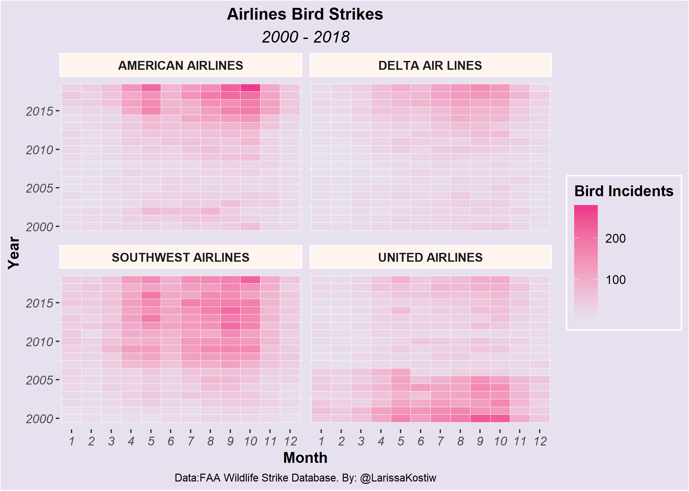
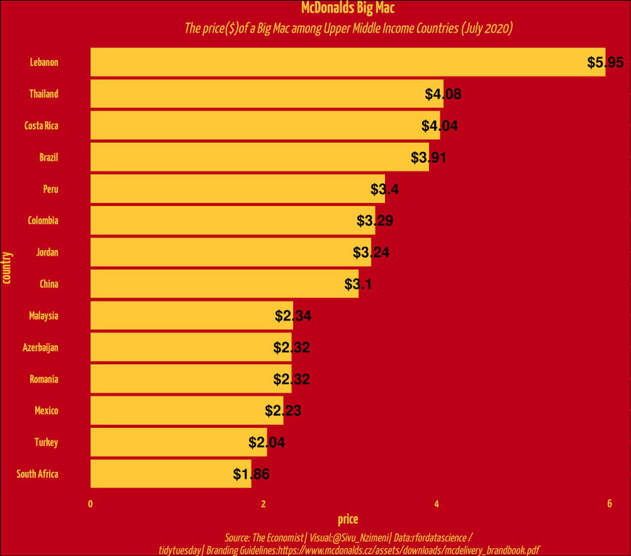
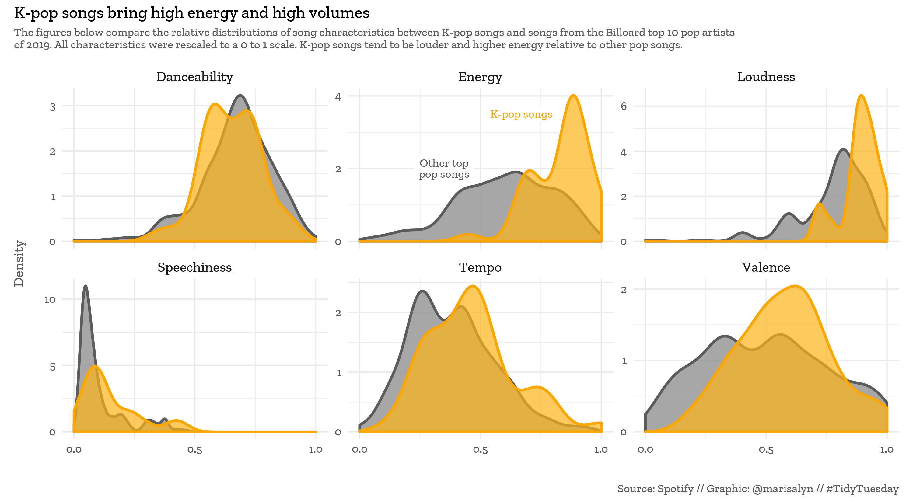

```{r setup, include=FALSE}
knitr::opts_chunk$set(echo = TRUE)
library(tidyverse)
```

## Reproducing plots

In each exercice, you will be given a static image of a plot. Your aim is to reproduce it as close as possible.

For each exercise, you will start with the raw data. Produce first a "basic" plot that has the same main idea, geom\_, facet\_, aes() than the target plot; then, by using scale\_, coord\_ and theme\_ functions, try to tweak the plot to get your creation as near as possible to the target.

**Remember: it is not important if you don't make it, the important is to try and to get your hands dirty and to code, code, code.**

Ready? go!

## Airline strikes



The data tells you all the times a plane has struck a bird in flight, for the US, for various years. Data is stored in the `strikes` data frame. Have a look at it, get familiar.

```{r}
strikes <- read_csv("https://raw.githubusercontent.com/rfordatascience/tidytuesday/master/data/2019/2019-07-23/wildlife_impacts.csv")

```

In a first chunk work on the **data**: use `filter`, `mutate`, `group_by`, `summarise`, `count` etc... to get the data you want. Think about what you *need* before you start coding. In this case, you need, for each airline, for each month and year, the *count* of incidents. Check that you got this right, then save it in an object of your choice (I usually use a name like `plotme` or `plotdf`.

```{r}

```

In a second chunk create a *simple* plot that has all the axes, geoms and facets needed. It will be ugly, but it will *work*: it shows the same relationship as the target plot. Here, you need to use a three-dimensional geom, where you have two categorical variables (month and year) and a third, continuous variable (the count of bird strikes). Look up in the *cheatsheet* or in the course notes which geom\_ will do the trick. Use facets. Save the plot in a `base_plot` object (or other name of your choice).

```{r}

```

In a third chunk tweak the plot to look like the target. Get as near as you can. Use `scale_`, `theme_` functions; think of `coord_` and think of the nature of the variables; remember that you can turn a categorical variable into a numeric one by using `mutate(var = as.character(var))` and a categorical into numeric (if that is possible) using `mutate(var = as.numeric(var)`. That might turn out to be useful.

```{r}

```

## Big Mac Index



The data tells you the cost of a big mac in time for different countries. The Big Mac index is used sometimes to compare countries for their purchasing power; since a Big Mac is a Big Mac (i.e. virtually identical) anywhere, its price tells you something about the relative prices in different countries and inflation (i.e. price changes in time).

The data, saved in `bigmac` object:

```{r}
bigmac <- read_csv('https://raw.githubusercontent.com/rfordatascience/tidytuesday/master/data/2020/2020-12-22/big-mac.csv')

```

A chunk for data manipulation. For this plot, you need to restrict attention to Upper Middle Income countries, and to July 2020 only.

```{r}

```

A chunk for the basic plot without styling: note that here you can use `geom_text` to put the dollar amounts on the bars. Check the course slides for L5, we did not cover that in class but we do have some stuff at the end on `geom_text`.

```{r}

```

A chunk for the style and the final plot. Note that this is not a particularly pretty plot, but it manipulates lots of things. Remember that within the `theme` call you can `tab` to search the various items you can change, and then you must change the `element_*` corresponding to what you want to change. Google around or look at the code from the lecture to get a feel of it.

```{r}

```

## K-pop



Data shows music genres and music characteristics from the Spotify database.

```{r}
spotify <- readr::read_csv('https://raw.githubusercontent.com/rfordatascience/tidytuesday/master/data/2020/2020-01-21/spotify_songs.csv')

```

In this case I'll help you out a bit and generate a `kpop` and `billboard` variables to get you started.

```{r}
kpop <- c(
  "bts",
  "blackpink",
  "twice",
  "広瀬大地", # "exo"
  "red velvet",
  "seventeen", 
  "stray kids",
  "nct 127", 
  "ikon", 
  "got7")
# https://www.billboard.com/charts/year-end/pop-songs-artists
# billoard top 10 pop artists of 2019
other_pop <- c(
  "ariana grande", 
  "post malone",
  "khalid",
  "jonas brothers",
  "halsey",
  "panic! at the disco",
  "shawn mendes",
  "billie eilish", 
  "lizzo", 
  "ed sheeran" )

df <- spotify %>% 
  filter(tolower(track_artist) %in% c(tolower(kpop), tolower(other_pop))) %>%
  mutate(kpop = if_else(tolower(track_artist) %in% tolower(kpop), 
                        1, 0), 
         kpop = factor(kpop)) 
```

Now you need to tidy your dataset, until you'll get a dataset with a row for each characteristic of each song (Danceability, Energy, ...). Do it in this chunk here:

```{r}

```

Now time for a not-so fancy plot: this should just be a matter of `geom_density` and `facet`ing.

```{r}

  

```

And now, make it fancy!

```{r}

```
