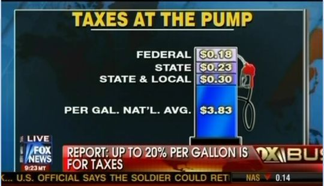
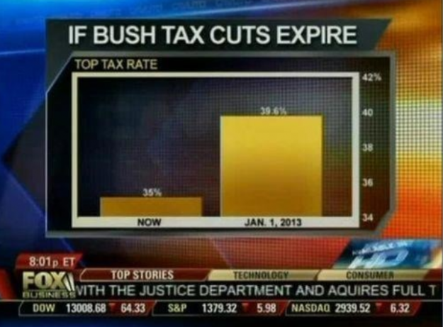
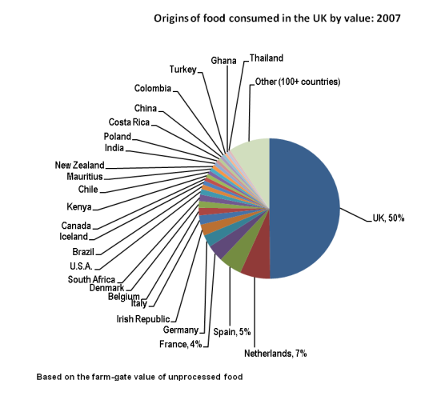
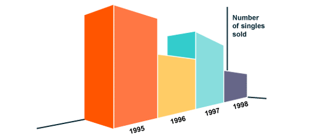
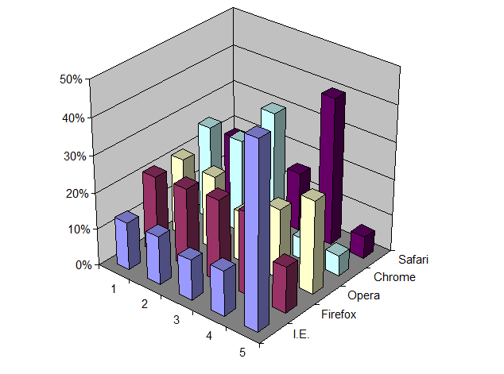
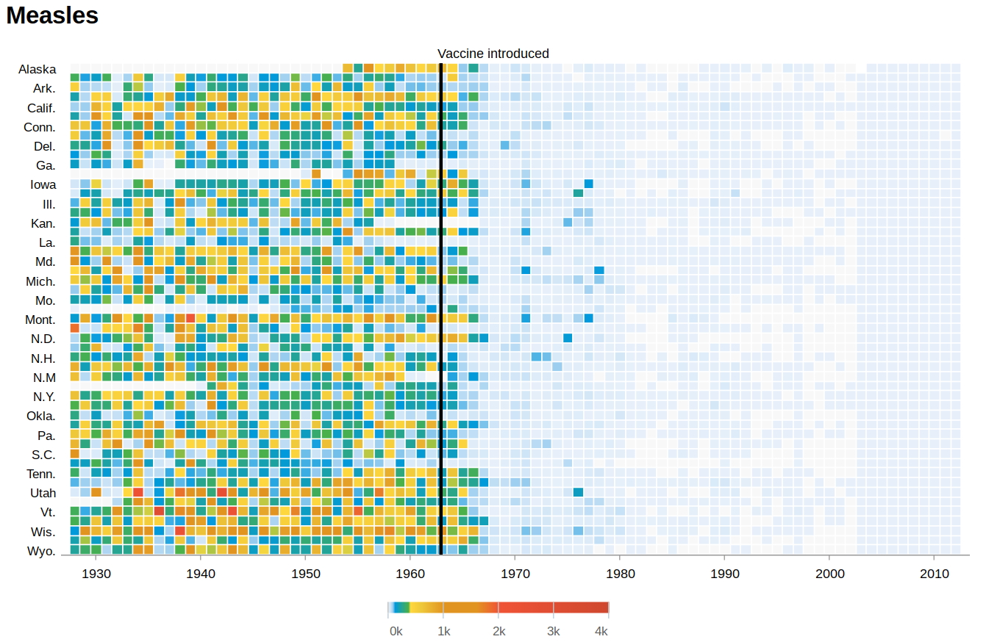
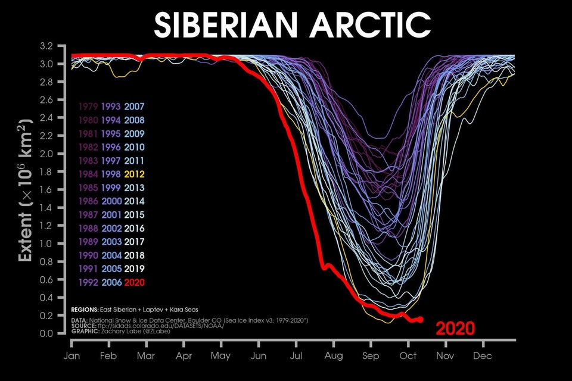

```{r setup, include=FALSE, warning=FALSE, message=FALSE, fig.align='center'}
knitr::opts_chunk$set(echo = TRUE)
knitr::opts_chunk$set(warnings = FALSE, message = FALSE)
library(tidyverse)
library(kableExtra)
theme_set(theme_minimal())
```

# Lecture 3: plotting

# Part 1: Why do we plot? 


## Why do we plot

> *Why do we want to plot data?*

- we are human beings -- we are pattern recognizers
- we can *see* things we are not able to grasp from data
- good to explore a dataset and look for regularities
- good to *convey a clear message*
- to have fun
- (to show your colleagues how nice your plot is)

## The importance of plotting: eyeballing the data

> Looking at the data as a *first step* of analysis is **always** a good idea

- data could look similar at a first glance
- and even have similar descriptive statistics (i.e. mean, variance)
- but still be *very* different in practice

## An example: the Datasaurus

> A striking example of this is the "Datasaurus dozen": a dull an not impressive dataset.

- data contains vars `x` and `y`, over 13 different conditions
- import the data (it is in `data/DatasaurusDozen.tsv`) and compute mean and st.dev. by `dataset`

```{r datas1, echo = TRUE, message=FALSE, warning=FALSE}
df <- read_tsv("data/DatasaurusDozen.tsv")
df %>% 
  group_by(dataset) %>% 
  summarise(mean_x = round(mean(x),2), mean_y = round(mean(y),2)) %>% 
  kable()
```

## Datasaurus, plotted

> But if you plot it, you'll see **stark** differences

```{r datas2, echo = FALSE}
df %>% 
  ggplot(aes(x,y))+
  geom_point()+
  facet_wrap(~dataset)
```


## The importance of plotting: compact information

> Plotting allows one to convey a lot of information in a compact way

- humans are pattern recognizers
- several geometric objects can convey meaning
  - position (x,y)
  - color
  - size
  - shape
- you can combine multiple plots to create infographics (cool!)

## Good plots, bad plots

- It is important to make *good* plots
- i.e., plots that *look good*...
- ...and are *honest* to the data

- it is very easy to *hide* the message rather than *highlighting* it
- it is very easy to *mislead* with a plot
- so let's start with a gallery of **bad plots**. Can you guess *why* they are bad?

## Bad plotting 1



## Bad plotting 2



## Bad plotting 3


## Bad plotting 4



## Bad plotting 5



## Bad plotting 5 (really, you don't need 3D plots)



## The road to good plotting

- know your data
- think before you hit the enter button
- sketch on paper first
- be honest
- draw your axis first
- choose your visualization wisely
- a good plot gives lots of precise information in a concise way. 

**Examples:**


## Good plots, 1

{width=100%}

## Good plots, 2

{width=100%}

## Good plots, 3

{width=100%}

## Good plots, 4

{width=100%}


# Plotting with ggplot

## Some data

We will start by using the *built-in dataset* **mpg**

```{r, echo=TRUE}
mpg
```


## A look at the data

- *model* : model name
- *displ* : engine displacement, in litres
- *year* : year of manufacture
- *cyl* : number of cylinders
- *trans* : type of transmission
- *drv* : f = front-wheel drive, r = rear wheel drive, 4 = 4wd
- *cty* : city miles per gallon
- *hwy* : highway miles per gallon
- *fl* : fuel type
- *class* : "type" of car

## A look at the data

```{r}
skimr::skim(mpg)
```


## We will be using `ggplot2`. Why?

Advantages of ggplot2

-   consistent underlying `grammar of graphics` (Wilkinson, 2005)
-   plot specification at a high level of abstraction
-   very flexible
-   mature and complete graphics system
-   theme system for polishing plot appearance
-   many users, active, fast & competent support

## What is a grammar of graphics?

The basic idea: independently specify plot building blocks and combine them to create just about any kind of graphical display you want. Building blocks of a graph include:

-   data
-   aesthetic mapping
-   geometric object
-   statistical transformations

-   scales
-   coordinate system
-   position adjustments
-   faceting

## Starting from the basics

**As in a grammar the minimal sentence is a subject in a plot the minimal object is data **

```{r, echo=TRUE, fig.width=7, fig.height=4}
ggplot(mpg)
```

## basics

**In a grammar, you need a verb. In plots, this is axis**

```{r, echo=TRUE, fig.width=7, fig.height=4}
p <- ggplot(mpg, aes(x = displ, y = hwy))
p
```

### Still no plot generated!


## Generating a plot

**But you also need an object. In ggplot, this is *geoms* **
```{r, echo=TRUE, fig.width=7, fig.height=4}
p + geom_point()
```

## Generating a plot, 2

**But you also need an object. In ggplot, this is *geoms* **
```{r, echo=TRUE, fig.width=7, fig.height=4}
p + geom_smooth()
```


## Generating a plot, 3

**You can add (+) as many *geoms* as you wish**
```{r, echo=TRUE, fig.width=7, fig.height=4}
p + geom_smooth()+geom_point()
```


## The beauty of a grammar metaphor

- once you get the main idea, adding things is easy
- a plot is a sentence made with data
- you add layers with `+`
- as you would add words to a sentence
- as in grammar you use adjectives to give more nuanced meaning, in plots you could use `+` to add color, fill, size, shape, etc...

## Adding meaning: color

```{r, echo=TRUE, fig.width=7, fig.height=4}
p + geom_point(aes(color=class))
```

## Adding meaning: size

```{r, echo=TRUE, fig.width=7, fig.height=4}
p + geom_point(aes(size=cyl))
```


## Adding meaning: color AND size

```{r, echo=TRUE, fig.width=7, fig.height=4}
p + geom_point(aes(size = cyl, color=class))
```

## Adding meaning: shape

```{r, echo=TRUE, fig.width=7, fig.height=4}
p + geom_point(aes(shape=fl))
```


## Adding meaning: all together (maybe too much)

```{r, echo=TRUE, fig.width=7, fig.height=4}
p + geom_point(aes(color=manufacturer, shape =fl, size = cyl))
```

## Recap so far

- ggplot works like a grammar
- start with `ggplot()`
- first argument is "the subject", i.e. *data*: `ggplot(df, ...)`
- then you map variables to `aes`thetics (x, y, color, fill, shape, size, ...)
- `ggplot(df, aes(dimension = variable))`
- then you add (+) meaning with geometric objects: `geom_*`
- `+ geom_line()`
- notes: 
  - `geom`s inherit the `aes` of the plot if not specified
  - all variables mapped to `aes` vary with the data

## Facets

- sometimes sentences become a bit too long
- it is useful to split them up in shorter sentences
- for instance, you could first talk about a car, *then* another one
- in plots, you can split up the plot along a variable
- so that one plot is drawn for each level of a given variable, say type of fuel

## Facets

```{r, echo=TRUE, fig.width=7, fig.height=4}
p + geom_point(aes(color=manufacturer, size = cyl))+facet_grid(.~fl)
```


## More details on the grammar

A ggplot is made up of

- data (subject)
- axis (verb)
- geoms (object)
- aesthetic layers (size, fill color, shape, label, ...)
- facets (splitting sentences)

And then you can change how things look and behave:
- coordinate functions (changing the axis appearance and type)
- scale functions (changing the appearance of the geoms)
- theme functions (changing the appearance of the plot itself)


## Exploring data with plots: one variable

*Plot types depend on the variable type*


- *one-variable plots, discrete variable*: barplot
- *one-variable plots, continuous variable*: distribution, density

## Barplots
- let's look at the drive type of the cars: front, rear, or 4wd

```{r, fig.width=7, fig.height=4}
p <- ggplot(mpg, aes(drv))
p + geom_bar()
```


## Barplots

- not so fancy. should we add color?

```{r, fig.width=7, fig.height=4}
p <- ggplot(mpg, aes(drv))
p + geom_bar(aes(color=drv))
```

## Barplots

- ups. Maybe we meant fill?

```{r, fig.width=7, fig.height=4}
p <- ggplot(mpg, aes(drv))
p + geom_bar(aes(fill=drv))
```


## Barplots

- what if we cross it with another variable?

```{r, fig.width=7, fig.height=4}
p <- ggplot(mpg, aes(drv))
p + geom_bar(aes(fill=class))
```


## Barplots

- By default stacked. How to unstack?

```{r, fig.width=7, fig.height=4}
p <- ggplot(mpg, aes(drv))
p + geom_bar(aes(fill=class), position = position_dodge())
```

## Barplots

- By default stacked. How to show relative weight?

```{r, fig.width=7, fig.height=4}
p <- ggplot(mpg, aes(drv))
p + geom_bar(aes(fill=class), position = position_fill())
```


## One variable, continuous: mpg on highway

* When the variable is continuous, it makes more sense to show distributions
```{r, fig.width=7, fig.height=4}
p <- ggplot(mpg, aes(hwy))
p + geom_histogram()
```

## Histograms: binwidth

```{r, fig.width=7, fig.height=4}
p + geom_histogram(bins = 10)
```

## Histograms: binwidth

```{r, fig.width=7, fig.height=4}
p + geom_histogram(bins = 100)
```

## An alternative do histogram: dotplot
```{r, fig.width=7, fig.height=4}
p + geom_dotplot(binwidth = 0.5)
```

## Continuous distribution: Kernel Density Estimation

```{r, fig.width=7, fig.height=4}
p + geom_density()
```

## Continuous distribution: Kernel Density Estimation

```{r, fig.width=7, fig.height=4}
p + geom_density(adjust = 3)
```

## Continuous distribution: Kernel Density Estimation

```{r, fig.width=7, fig.height=4}
p + geom_density(adjust = 0.5)
```


## Exploring data with plots: two variables

*Plot types depend on the variable type*


- *both vars continuous*: scatter, smooth
- *one continuous, one discrete*: columns (i.e., bars), boxplot, violins
- *both discrete*: count


## Scatter

> if two variables are continuous, your choice is scatter

```{r, fig.width=7, fig.height=4}
p <- ggplot(mpg, aes(x = cty, y = hwy))
p + geom_point()
```

## Smooth

> still, you might just want to show the general tendency

```{r, fig.width=7, fig.height=4}
p + geom_smooth()
```

## Scatter + smooth

> or both

```{r, fig.width=7, fig.height=4}
p + geom_smooth() + geom_point()
```


## Columns: a special type of bars

> one variable discrete, the other continuous (note: it needs a `summarise()`)

```{r, fig.width=7, fig.height=4}
mpg %>% group_by(manufacturer) %>% summarise(n = n()) %>% 
ggplot(aes(manufacturer, n))+
  geom_col()
```

## Columns: why bother?

> the above could have been easily done with geom_bar (that counts for us)

```{r, fig.width=7, fig.height=4}
mpg %>% ggplot(aes(manufacturer))+
  geom_bar()
```

## Columns: a special type of bars

> but columns give you more options, since now you condition on a proper variable (n). For instance: order by n

```{r, fig.width=7, fig.height=4}
mpg %>% group_by(manufacturer) %>% summarise(n = n()) %>% 
ggplot(aes(reorder(manufacturer, -n), n))+
  geom_col()
```


## Boxplots

> boxplots show a distribution but can do so over different levels of a categorical var

```{r, fig.width=7, fig.height=4}
mpg %>% ggplot(aes(drv, hwy))+
  geom_boxplot()
```

## An alternative to boxplot: violin

> boxplots are bulky and only show relevant info. Want full distribution? Use violins

```{r, fig.width=7, fig.height=4}
mpg %>% ggplot(aes(drv, hwy))+
  geom_violin()
```


## An alternative to boxplot: violin

> remember: all is modular. We can always add color, fill...

```{r, fig.width=7, fig.height=4}
mpg %>% ggplot(aes(drv, hwy, color = drv, fill = drv))+
  geom_violin()
```

## An alternative to boxplot: violin

> remember: all is modular. ...facets

```{r, fig.width=7, fig.height=4}
mpg %>% ggplot(aes(drv, hwy, color = drv, fill = drv))+
  geom_violin()+
  facet_grid(.~year)
```

## Counts

> if both variables are categorical, you can count their cross-tabulation

```{r, fig.width=7, fig.height=4}
mpg %>% ggplot(aes(fl, drv))+
  geom_count()
```


## Exploring data with plots: three variables

*Plot types depend on the variable type*


- *all continuous*: contour plot (think: elevation in maps)
- *some discrete*: tile

## Tile

> two variables define the x,y grid. A third defines the color of the cell. city consumption by year and drive (note: usually requires `summarise()`)

```{r, fig.width=7, fig.height=4}
mpg %>% group_by(year, drv) %>% summarise(n = n()) %>% 
  ggplot(aes(x = drv, y = year, fill = n)) +  geom_tile()
```

## Additional resources

- the ggplot **cheatsheet** is your friend (Help -> cheatsheets)
- **stack overflow** helps out for trickier questions
- not feeling inspired? 50 cool visualisations here: http://r-statistics.co/Top50-Ggplot2-Visualizations-MasterList-R-Code.html
- need a complete tour of possibilities? https://www.r-graph-gallery.com/
