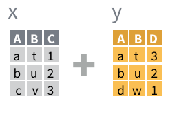
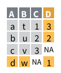
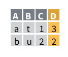
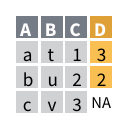

```{r setup, include=FALSE, warning=FALSE, message=FALSE, fig.align='center'}
knitr::opts_chunk$set(echo = TRUE)
library(tidyverse)
theme_set(theme_minimal())
```

# Lecture 4: join & reshape


## Todays topics

> today we will deal with two topics:

1. joining data from different tables
2. *tidying* data
  - reshaping
  - cleaning
  - separating


# Joining datasets

## data scattered around

> you do not always have all the data you need in *one* dataset

- it is usually scattered around several datasets
- that might or might not be linked / linkable
- e.g. you might need to merge data coming from different sources (INSEE and Eurostat)
- or you might do some computations / summarize and would like to merge these back

## using the `nycflights13` dataset again

- planes

```{r}
library(nycflights13)
planes <- nycflights13::planes
planes
```

## using the `nycflights13` dataset again

- airports

```{r}
airports <- nycflights13::airports
airports
```


## using the `nycflights13` dataset again

- flights

```{r}
flights <- nycflights13::flights
flights
```


## inspect the datasets

> what do these dataset contain?

- what variables do they have in common?
- do they have some unique identifier (`key`)?
- how are these related to one another?

## the datasets

- *planes* has information on each plane (model, type, date of construction...)
- *airports* has information on each airport (faa code, location, lat, long )
- *flights* has information on each flight that left/landed in a NYC airport

## joining different datasets: example

> problem: do newer planes fly the longest routes from NYC?

- to answer this, you need to combine data from two sources: 
- *flights* to get the route's length in terms of miles
- *planes* to get the date the plane was first operational

> how do you *join* the two data frames?

## joining two datasets: **key**

- *first* you need to find a *unique identifier* for your data: a **key**
- unique identifiers have the characteristics of being unique in the whole dataset
- in order to find them, either you use your intuition
- or you check

```{r}
planes %>% count(tailnum) %>% filter(n>1)
```

- `count(var)` gives the count of how many times each element of `var` appears as a new variable `n`
- by filtering for just `n>1` you check if any value appears twice

## joining

> once you know the key, you can use the `join` family of functions

- imagine you have two datasets with variables and values as follows:



- there is some overlapping information on the two tables
- but there is also new information
- column D only in dataset Y
- row 'c' only in dataset X; row 'd' only in dataset Y

## joining

> joining always combines data from *two* tables into *one*

- syntax alays the same: `join(left, right, by = "key")`
- *left* and *right* two data frames
- *key* the unique identifier of obsevations (in one or both data frames)

## the joining family

- different `join` functions make different assumptions about what to do of the data that are NOT matched

-  `full_join()` keeps everything, adds `NA`

-  `inner_join()` keeps only matched data

-  `left_join()` keeps *all* keys in the *left* df


## the default `left_join()`

> `left_join()` is the default because you usually add *some* variable to a large dataset

- in our case: * do newer planes fly the longest routes from NYC?*

- we have most information on the *flights* dataset
- we need only the year built from the *planes* dataset

## answering our question -- joining

```{r}
distance <- flights %>% select(tailnum, distance)
yearbuilt <- planes %>% select(tailnum, year)
answer <- left_join(distance, yearbuilt, by = "tailnum")
answer
```


## answering our question: the answer

- there does not seem to be any connection beteen the year and the length of the flight
```{r, warning=FALSE, message=FALSE}
answer %>% group_by(year) %>% 
  summarise(dist = mean(distance, na.rm = TRUE)) %>% 
  ggplot(aes(x = year, y = dist))+geom_point()+
  geom_smooth(method = "lm")
```


## joining exercise

> how many flights through NYC land in an airport whose altitude is > 1000mt?

- note: 1 mètre = 3,28084 feet
- altitude is in the *airports* df (in feet)
- flights are in the *flights* df

## solution

- a lot of flights, since denver sits at 1600mt!

```{r}
alt_df <- airports %>% select(faa,alt) %>% mutate(alt = alt/3.28024) %>% rename(dest = faa)
answer <- left_join(flights, alt_df, by = "dest") %>% filter(alt>1000) 
answer
```


## joining three datasets

> how old are the planes that fly to airports whose altitude is >1000mt?

## joining three datasets, solution

```{r}
answer <- left_join(flights,yearbuilt, by = "tailnum")
answer <- left_join(answer, alt_df, by = "dest")
answer %>% filter(alt>1000) %>% summarise(avgyear = mean(year.y, na.rm = TRUE))
answer %>% filter(alt<=1000) %>% summarise(avgyear = mean(year.y, na.rm = TRUE))
```


# tidy data

## messy data -> tidy data

> “Happy families are all alike; every unhappy family is unhappy in its own way.” –– Leo Tolstoy

- the data we have worked with so far are all well formatted
- this is *not* the case in real life
- we need to be able to *format data in a convenint way*
- if you work with the tools we've seen (`dplyr`, `ggplot2`) then you want *tidy* data

## a simple dataset in four versions

```{r}
table1
```

## a simple dataset in four versions

```{r}
table2
```

## a simple dataset in four versions

```{r}
table3
```

## a simple dataset in four versions

```{r}
table4a  #cases
table4b  #population
```

## tidy, untidy data

> tidy dat has the following characteristics:

- each variable has its own column
- each observation has its own row
- each value has its own cell

> have a look at the tables.

- what is an observation?
- what is a variable?
- do you see problems in the tables?

## tidy data: the `tidyr` package

- `tidyr` is part fo the tidyverse
- it is automatically loaded with `library(tidyverse)`
- `tidyr` provides 4 main verbs
- `pivot_longer` vs. `pivot_wider`
- `separate` vs. `unite`

## from wide to long: `pivot_longer`

> sometimes variables are in the column names: bad!

```{r}
table4a
```

- 'year' is a variable but it is on the column names
- content is 'cases' but has no variable name

## reshaping to longer

> we need to reshape the data from *wide* to *long*, so that *year* becomes a variable and *1999* and *2000* become values.

- we use `pivot_longer(vars, names_to = ..., values_to =...)`
- `vars` is the variable names that are not actually variables but values
- `names_to` is the (new) name to be given to the (new) column that will be created to store the (former) variable names
- `values_to` is the (new) name to be given to the  (new) column that will be created to store the values that were spread over several variables


## reshaping to longer

> what if we provide just the columns? 

```{r}
table4a %>% pivot_longer(!country)
```

- it works: it correctly guesses that the columns provide the name and the values provide the values. 

## reshaping to longer

> what if we provide full arguments? 

```{r}
table4a %>% pivot_longer(!country, names_to = "year", values_to = "val")
```

- arguments allow us to provide custom names 
- always better to spell out all arguments for future readability of the code
- often the automatic detection fails!


## reshaping to wider

Let's look at a messy version of table1. 
```{r}
table2
```

## reshaping to wider

> we need to reshape the data from *long* to *wide*, so that *type* gets split into the variables *cases* and *population* and *count* values get assigned to the proper column.

- we use `pivot_wider(vars, names_from = ..., values_from = ...`
- `names_from` is the (existing) name of the column that contains variable names
- `values_from` is the (existing) name of the variable that contains values of the (to be created) variables


## reshaping to wider

```{r}
table2 %>% pivot_wider(names_from = type, values_from = count)
```

## pivot_longer and pivot_wider are inverse functions

- if you pivot_longer a data frame then you pivot_wider, you get the original df.
- step 1: mess up the data

```{r}
table1 %>% pivot_longer(!country & !year)
```


## pivot_longer and pivot_wider are inverse functions

- step 2: get back in shape

```{r}
table1 %>% pivot_longer(!country & !year) %>% pivot_wider(names_from = name, values_from = value)
```

## separating: from one to more variables

> what is wrong with this table?

```{r}
table3
```

## separating

> the variable *rate* contains two informations: number of cases and population

- we need to *separate* the variable *into* two (in this case) variables

```{r}
separate(table3, col = rate, into = c("cases", "population"))
```

## separating

-`separate()` correctly guessed that the point to separate was "/"
- but this is not always so easy
- so you can provide the actual separator character with `sep=`
- if we use the wrong one...

```{r}
separate(table3, col = rate, into = c("cases", "population"), sep = "7")
```

## separating

> `separate()` keeps the variables as characters

- this is safe: doesnt make assumptions
- but sometimes it is best to have it create `int` or `dbl` variables

```{r}
separate(table3, col = rate, into = c("cases", "population"), convert = TRUE)
```


## uniting: from several to one variable

```{r}
table5
```

## uniting

> the complementary verb to `separate()` is `unite()`

```{r}
unite(table5, year, century, year)
```

- by deault `unite()` uses `_` as a separator

## uniting

```{r}
unite(table5, year, century, year, sep = "")
```


