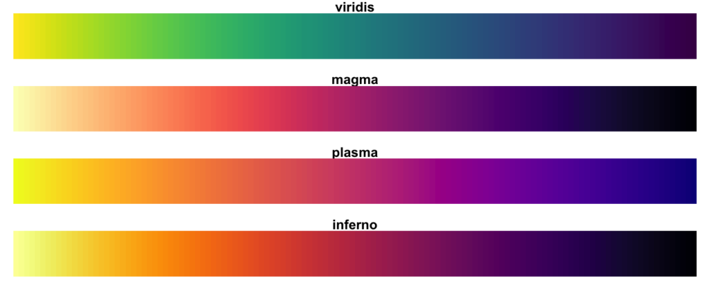
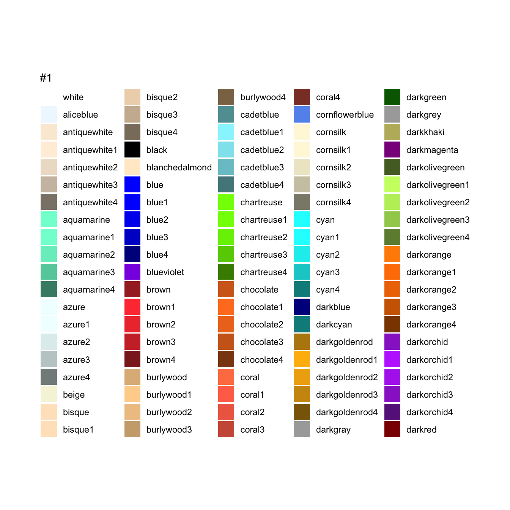

```{r setup, include=FALSE, warning=FALSE, message=FALSE, fig.align='center'}
knitr::opts_chunk$set(echo = TRUE)
knitr::opts_chunk$set(warnings = FALSE, message = FALSE)
library(tidyverse)
library(kableExtra)
theme_set(theme_minimal())
```

# Lecture 5: advanced plotting

# 1. Tweaking ggplots


## Small Recap of ggplot

> *A general ggplot template*

`ggplot(data = ..., aes(x = ..., y = ..., ...))+`

`geom_*()+` add geometrical objects (points, lines, areas, ...)
    
`facet_*()+` split in subplots
    
`coord_*()+` changes the coordinate system
    
`scale_*_*()+` changes the way `geoms` look
    
`theme_*()` changes the look & feel of the plot


## A base plot to work with

```{r}
base <- iris %>% 
  ggplot(aes(x = Sepal.Length, y = Sepal.Width, 
             color = Species, size = Petal.Width))+
  geom_point()
base
```

# Coordinates

## Coord_functions

> `coord_*` functions change the behavior / scale of the **axes**

- invert coordinates
- boundaries
- scale (linear, log)
- type (cartesian, polar)


## Invert axes

```{r}
base + coord_flip()
```


## Cartesian linear coordinates: limits

> change the limits of the plot to 'zoom' on a part of it (!!handle with care!!)

```{r}
base + coord_cartesian(xlim = c(5, 6), ylim = c(3,4))
```


## Cartesian linear coordinates: fixed

> sometimes you need the two scales on the two axes to be comparable

```{r}
ggplot(mpg, aes(cty, hwy)) + geom_point() + labs(title = "It looks like mileage in City and Highway is the same!")
```

## Cartesian linear coordinates: fixed

> sometimes you need the two scales on the two axes to be comparable

```{r}
ggplot(mpg, aes(cty, hwy)) + geom_point() + 
  coord_fixed() + labs(title = "But mileage is higher in highways!")
```

## Cartesian linear coordinates: fixed

> sometimes you need axes to be n an exact proportion

```{r}
ggplot(mpg, aes(cty, hwy)) + geom_point() + 
  coord_fixed(ratio = 1/5) + labs(title = "City is 5 times as big as highway here")
```


## coordinate transformations

> log scales

```{r}
ggplot(mpg, aes(cty, hwy)) + geom_point() + coord_trans(x = "log10", y = "log10")+ labs(title = "log axes")
```


## polar coordinates

> we can also transform a (x,y) coordinate into a (distance, angle)

```{r}
base + coord_polar()
```

## Polar coordinates: pie charts

> this is the only way to make a pie chart in ggplot: a bar chart in polar coordinates. 

```{r}
ggplot(mpg, aes(x = "", y = class, fill = class)) + geom_col()
```

## Polar coordinates: pie charts

> this is the only way to make a pie chart in ggplot: a bar chart in polar coordinates. 

```{r}
ggplot(mpg, aes(x = "", y = class, fill = class)) + geom_col() + coord_polar("y", start = 0)
```

# Scales

## Scale functions

> `scale_*_*` functions change the **appearance** of the **mapping**

- general usage: `scale_NAME_TYPE`
- `NAME` can take values: alpha, color, fill, linetype, shape, size, x, y
- `TYPE` can take different values according to the scale type

## A simple example

> make our base plot greyscale and change the size mapping

```{r}
base + scale_color_grey() + scale_size_continuous(range = c(1, 10))
```


## Changing colors: `scale_color_*`

> Manipulating colors is fun! but you need to pay attention to some stuff

- is your color variable *continuous* or *discrete*?
- do you want a gradient? 
- can colorblind people use your plot? 


## Discrete color scales

> Brewer palettes

```{r}
base + scale_color_brewer()
```

## Discrete color scales

> Brewer palettes

```{r}
base + scale_color_brewer(type = "qual")
```


## Discrete color scales

> Brewer has many palettes

```{r}
base + scale_color_brewer(palette = "Set1")
```

## Discrete color scales

> Viridis palette

```{r}
base + scale_color_viridis_d()
```


## Info on color palettes: brewer

```{r}
RColorBrewer::display.brewer.all()
```

## Info on color palettes: viridis




## Still not enough colors? `manual` scales

```{r}
base + scale_color_manual(values = c("pink", "violet", "brown"))
```


## Colors in R

{height=80%}

## Continuous color

> a simple plot to showcase stuff

```{r}
base2 <- ggplot(iris, aes(x = Sepal.Length, y = Sepal.Width, color = Petal.Width))+
  geom_point()
base2
```


## Continuous color: gradients

> change the gradient

```{r}
base2 + scale_color_gradient(low = "green", high = "red")
```

## Continuous color: gradients

> a gradient with an intermediate step

```{r}
base2 + scale_color_gradient2(low = "red", mid = "grey", high = "green", midpoint = mean(iris$Petal.Width))
```


## In-between continuous and discrete: binned scales

> Sometimes you have continuous data but you want to treat it as discrete: `binned` scales

```{r}
base2 + scale_color_binned()
```

## Continuous color: gradients

> change the gradient to be colorblind proof

```{r}
base2 + scale_color_viridis_c()
```


## Continuous size


```{r}
base + scale_size_continuous(range = c(1,12))
```


## binned size

```{r}
base + scale_size_binned(n.breaks = 3, range = c(1,12))
```


## Controlling barplots: fill

> in barplots, the relevant variable is the fill

```{r}
ggplot(mpg, aes(x = manufacturer, color = manufacturer)) + geom_bar()
```


## Controlling barplots: fill

> in barplots, the relevant variable is the fill

```{r}
prod <- ggplot(mpg, aes(x = manufacturer, fill = manufacturer)) + geom_bar()
prod
```

## Controlling barplots: fill

```{r}
prod + scale_fill_viridis_d()
```


## Not-mapped appearance

> if appearance **does not vary** then pass it directly:

```{r}
ggplot(mpg, aes(x = manufacturer)) + geom_bar(fill = "red")
```

# Theme

## Theming the plot

> `theme` functions refer to the appearance of **everything** but the mapping

- pre-installed themes (e.g. `theme_minimal()`)
- extra themes (e.g. `ggthemes`, `hrbrthemes`)
- fine_tuning the themes: `theme()`
- changing the labesl: `labs()`

## pre-installed themes gallery

```{r}
base + theme_classic()
```

## pre-installed themes gallery

```{r}
base + theme_dark()
```


## pre-installed themes gallery

```{r}
base + theme_linedraw()
```

## pre-installed themes gallery

```{r}
base + theme_void()
```

## install new themes and use theme

```{r}
install.packages("ggthemes")
library(ggthemes)
base + theme_excel_new()
```

## install new themes and use them

```{r}
library(hrbrthemes)
base + theme_ipsum_rc()
```

## fine-tuning themes: `theme()`

```{r}
base + theme(legend.position = "left")
```

## fine-tuning themes: `theme()`

```{r}
base + theme(panel.background = element_rect(fill = "yellow"))
```

## adding titles

```{r}
base + labs(title = "title", subtitle = "subtitle", caption = "CAPTION", tag = "tag")
```


## saving a plot

> to save a plot to file, use `ggsave()`. By default it saves the last plot made

`ggsave(filename, width, height, dpi)`

# Annotations and lines

## adding non-data driven elements

> sometimes you need to add some lements that are not in the data

- reference lines or areas
- text
- annotations

## lines

> there are three types of lines:

- horizontal
- vertical
- y = ax + b

## lines

```{r}
base + geom_hline(yintercept = 3, color = "red")
```

## lines

```{r}
base + geom_vline(xintercept = 5, color = "blue")
```

## lines

```{r}
base + geom_abline(slope = 0.8, intercept = -2, color = "orange")
```

## Text as a `geom`

> there are two text geoms: `text` and `label`

```{r}
carspeed <- mpg %>%  filter(year == 2008 & trans == "manual(m5)") %>% ggplot(aes(x = cty, y = hwy))
carspeed + geom_point()
```

## Text as a `geom`

> labeling cars by their name: text

```{r}
carspeed + geom_text(aes(label = model))
```


## Text as a `geom`

> labeling cars by their name: label

```{r}
carspeed + geom_label(aes(label = model))
```


## Text as a annotation

> just put a custom text somewhere

```{r}
base + annotate(geom = "text", label = "ANNOTATION", x = 6, y = 4, hjust = 0)
```


## Additional resources

- the ggplot **cheatsheet** is your friend (Help -> cheatsheets)
- **stack overflow** helps out for trickier questions
- not feeling inspired? 50 cool visualisations here: http://r-statistics.co/Top50-Ggplot2-Visualizations-MasterList-R-Code.html
- need a complete tour of possibilities? https://www.r-graph-gallery.com/
