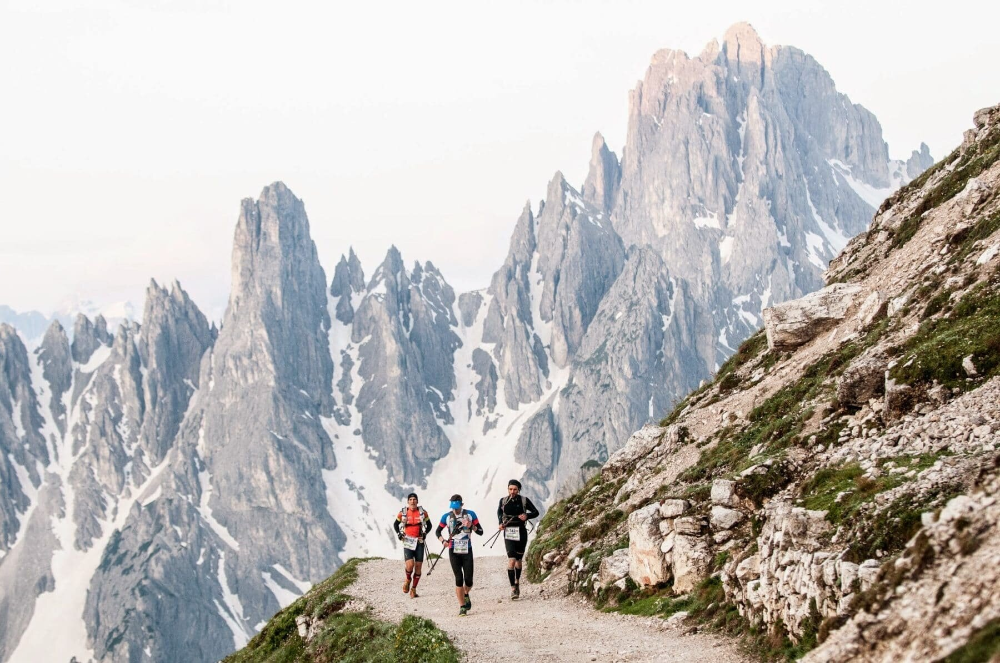

Le trail running est la pratique de la course à pied en pleine nature. C'est un sport hors stade très complet qui sollicite les jambes certes mais également le haut du corps. Il demande beacoup de concentration, prudence et endurance. 

La base de données qui a servi de base à cette étude contient des informations de l'International Trail Running Association sur des trails de différentes distances (de 33.3 à 179 km) organisées dans le monde de 2012 à 2021. 

Dans ce travail, nous allons nous concentrer sur **l'ultra trail running**. Ce terme est généralement utilisé pour les distances supérieures à 80 km. Nous essaierons d'identifier les tendances de l'ultra trail au cours des 10 dernières années et de répondre aux questions suivantes:

* Quel est le profil du coureur d'ultra trail typique (âge, sexe) ? Qui a le plus de chances de réussir dans ce sport?

* Dans quels pays ce sport est-il le plus développé et populaire? Comment la popularité de ce sport a-t-elle évolué au fil du temps?

* Qu'est-ce qui est le plus populaire: les courses en équipe ou les courses individuelles?

* Qu'est-ce qui détermine le nombre de points d'assistance sur la piste ?

* Est-il vrai que les événements d'ultra trail sont généralement organisés dans les hautes terres?

```{r, echo=FALSE, results='hide', message=FALSE}
# Chargement des données et des bibliothèques

library(tidyverse)
library(dplyr)

ultra_rankings <- readr::read_csv('https://raw.githubusercontent.com/rfordatascience/tidytuesday/master/data/2021/2021-10-26/ultra_rankings.csv')
race <- readr::read_csv('https://raw.githubusercontent.com/rfordatascience/tidytuesday/master/data/2021/2021-10-26/race.csv')
utr <- merge(x = ultra_rankings, y = race, by = 'race_year_id')
```

```{r, echo=FALSE, results='hide', message=FALSE}
# Nettoyage des données

# Supprimons les colonnes inutiles pour notre analyse
utr[ ,c('time', 'event', 'city', 'start_time', 'race_year_id', 'elevation_loss')] <- list(NULL)

# Faison summary pour identifier les problèmes de données possibles
summary(utr)

# Supprimons les lignes avec des valeurs manquantes ou nulles afin qu'elles ne faussent pas l'analyse des données
utr <- na.omit(utr)
utr <- utr %>% filter_at(vars(age, distance, elevation_gain, aid_stations, participants), all_vars(. > 0))

# Il est douteux que l'âge du participant de l'ultra trail soit supérieur à 100 - supprimons telles valeurs
utr <- utr %>% filter(age <= 100)

# Réduisson la date de trail à un an (nous n'avons pas besoin d'une date plus détaillée pour l'analyse)
utr$date <- utr$date %>% format(format ='%Y')
```


```{r, echo = FALSE, results='hide', message=FALSE}
# Voilà la table optimale pour l'analyse:

head(utr)
```

## Quel est le profil du coureur d'ultra trail? 

- **Quel est l'âge typique des coureurs d'ultra trail?**

L'âge moyen d'un participant de l'ultra trail est *45 ans*, et la moitié de tous les participants sont dans la catégorie d'âge *39-51*. 
Il est intéressant que seulement *0,3%* des coureurs ont moins de 25 ans, tandis que le pourcentage de coureurs de plus de 60 ans est *4%*.

```{r, echo = FALSE}
summary(utr$age)

young <- utr %>% filter(age < 25)
young_pct <- round(nrow(young)/nrow(utr)*100, 1)
old <- utr %>% filter(age > 60)
old_pct <- round(nrow(old)/nrow(utr)*100, 1)

cat("Pourcentage de coureurs de moins de 25 ans:", young_pct, "% 
Pourcentage de coureurs de plus de 60 ans:", old_pct, "%")
```
```{r}
age <- ggplot(utr, aes(x = age)) +
  geom_boxplot(color="dark green", fill="light green", alpha=0.2) +
  theme_classic()
age
```


- **Est-ce que plus d'hommes ou de femmes participent aux trails de plus de 80 km? Comment la composition par gender des races change-t-elle au fil du temps ?**

Traditionnellement, en raison de la difficulté de courir sur de telles distances, il y a beaucoup plus d'hommes que de femmes sur les ultra trails.En moyenne sur l'ensemble des années, seuls **16%** des coureurs sont des femmes. 

De plus, il est à noter que cette tendance n'a pas changé au fil des ans et que le pourcentage de femmes parmi les participants à l'ultra trail demeure à peu près au même niveau (sauf en 2014, où, pour une raison quelconque, le pourcentage de femmes était beaucoup plus élevé et était de 25 %). Tout de même, l'ultra trail est un sport pour les plus forts et les plus endurants et souvent au-delà du pouvoir des filles!

```{r, warning=FALSE, message=FALSE}
utr %>% 
  group_by(date, gender) %>% 
  summarise(n = n()) %>% 
  ggplot(aes(date, n , fill = gender)) +
  scale_fill_brewer(palette="Green") +
  geom_bar(stat = "identity", width = 1, color = 'black', position = position_stack(reverse = TRUE)) +
  ggtitle("Composition par gender des ultra trails par année") +
  theme_minimal()

women_growth <- utr %>% 
  group_by(date, gender) %>% 
  summarise(n = n()) %>% 
  pivot_wider(names_from = gender, values_from = n) %>% 
  mutate(women_pct = round((W / (W + M)) * 100,1))
  
women_growth %>% 
  ggplot() + 
  geom_bar(aes(x = date, y = women_pct), stat = "identity", fill = "light green", color = "light green") +
  geom_line(aes(x = date, y = women_pct), stat="identity", color = "dark green", group = 1) +
  geom_text(aes(label = women_pct, x = date, y = women_pct), color="dark green", vjust = -0.5) +
  ggtitle("Pourcentage de femmes participant à des ultra trails par année") +
  theme_minimal() 
```

- **Qui a le plus de chances de réussir dans ce sport?**

Il semble qu'un homme de 35-46 ans ait les meilleures chances de gagner un trail sur une distance de plus de 80 km. Pas étonnant!

```{r, warnings = FALSE, echo = FALSE}
winners <- utr %>% 
  filter(rank == c(1,2,3))
print("Âge des meilleurs coureurs:")
summary(winners$age)
```

```{r, warning=FALSE}
winners_gender <- winners %>% 
  group_by(gender) %>% 
  summarise(n = n()) %>% 
  pivot_wider(names_from = gender, values_from = n) %>% 
  mutate(women_pct = round((W / (W + M)) * 100,1)) %>% 
  mutate(men_pct = round((M / (W + M)) * 100,1))

winners_gender <- winners %>% 
  group_by(gender) %>% 
  summarise(n = n())

winners_gender %>% 
  ggplot(aes(x = "", y = n, fill = gender)) +
  geom_bar(stat = "identity", width = 1) +
  coord_polar("y", start = 0) +
  theme_void() +
  scale_fill_brewer(palette="Green") +
  geom_text(aes(label = n, vjust = 0.5, hjust = 1.2), color = "dark green", size=4) +
  ggtitle("Le nombre de femmes et d'hommes parmi les lauréats des trails")
```

## Dans quels pays ce sport est-il le plus développé et populaire? Comment la popularité de ce sport a-t-elle évolué au fil du temps?

Au total,  de 2012 à 2021, des athlètes de 120 pays ont participé aux ultra trails organisées dans 50 pays différents.

```{r, echo=FALSE, results='hide'}
nationality <- utr %>% 
  group_by(nationality) %>% 
  summarise(n = n()) %>% 
  arrange(desc(n))
nrow(nationality)
```

```{r, echo=FALSE, results='hide'}
country <- utr %>% 
  group_by(country) %>% 
  summarise(n = n()) %>% 
  arrange(desc(n))
nrow(country)
```

- **De quels pays viennent le plus de coureurs?**

Le plus grand nombre de coureurs viennet des **États-Unis**, de la **France** et du **Royaume-Uni**. Au total, ils représentent plus de la moitié de tous les participants aux ultra trails. Il y a aussi beaucoup d'athlètes de Chine, d'Espagne, du Japon, de Suède, d'Italie, de Russie et du Canada.

```{r, message=FALSE}
nationality <- nationality %>% 
  mutate(percentage = round(n / sum(n) * 100, 1)) %>% 
  top_n(10)

nationality %>%
  mutate(nationality = factor(nationality, nationality)) %>%
  ggplot(aes(x = nationality, y = n, size = n, color = nationality)) +
    geom_point(alpha = 0.8) +
    scale_size(range = c(.1, 24), name="Nombre de coureurs") +
    theme(legend.position = "none") +
    ylab("nombre de courreurs") +
    ylim(0, 15000) +
    geom_text(aes(label = n, vjust = 0.5), color = "black", size=2.5) +
    ggtitle("Top 10 pays avec le plus d'athlètes participant aux ultra trials") +
    theme(panel.background = element_rect(fill = "white", colour = "light grey", size = 2, linetype = "solid"),
    panel.grid.major = element_line(size = 0.5, linetype = 'solid', colour = "light grey"), 
    panel.grid.minor = element_line(size = 0.25, linetype = 'solid', colour = "light grey"))
```


- **Dans quels pays le plus de trails sont-ils organisés?**

La plupart des événements d'ultra trail se déroulent en France, aux États-Unis et au Royaume-Uni. Ensemble, ils représentent près de 76% de toutes les races. Il y a aussi beaucoup d'événements en Chine, en Espagne,au Japon, en Suède, en Suisse, en Nouvelle-Zélande et en Argentine.

```{r, message=FALSE}
country <- country%>% 
  mutate(percentage = round(n / sum(n) * 100, 1)) %>% 
  top_n(10)

country %>%
  mutate(country= factor(country, country)) %>%
  ggplot(aes(x = country, y = n, size = n, color = country)) +
    geom_point(alpha = 0.8) +
    scale_size(range = c(.1, 24), name="Nombre d'événements") +
    theme(legend.position = "none") +
    ylab("nombre d'événements") +
    ylim(0, 20000) +
    geom_text(aes(label = n, vjust = 0.5), color = "black", size=2.5) +
    ggtitle("Top 10 pays avec le plus d'événements d'ultra trail") +
    theme(axis.text.x = element_text(size=8, angle=45, hjust = 1)) +
    theme(panel.background = element_rect(fill = "white", colour = "light grey", size = 2, linetype = "solid"),
    panel.grid.major = element_line(size = 0.5, linetype = 'solid', colour = "light grey"), 
    panel.grid.minor = element_line(size = 0.25, linetype = 'solid', colour = "light grey"))
```

- **Comment la popularité de ce sport a-t-elle évolué au fil du temps?**

De 2012 à 2019, la popularité de l'Ultra Trail Running a augmenté à un rythme impressionnant. Ainsi, depuis 8 ans, le nombre annuel de participants aux trails a multiplié par près de 60!
Cependant, en 2020, il y a eu une forte baisse associée à la pandémie de coronavirus et aux restrictions sur les événements publics, ainsi que les voyages internationaux.

```{r}
utr %>% 
  group_by(date) %>% 
  summarise(n = n()) %>% 
  ggplot(aes(date, n)) +
  geom_bar(stat = "identity", width = 1, color = 'dark green', fill = 'light green', position = position_stack(reverse = TRUE)) +
  geom_line(color = "black", group = 1) +
  ggtitle("Le nombre d'athlètes ayant participé aux ultra trails par année") +
  geom_text(aes(label = n, vjust = -0.5), color = "dark green", size = 3) +
  theme_minimal()
```


