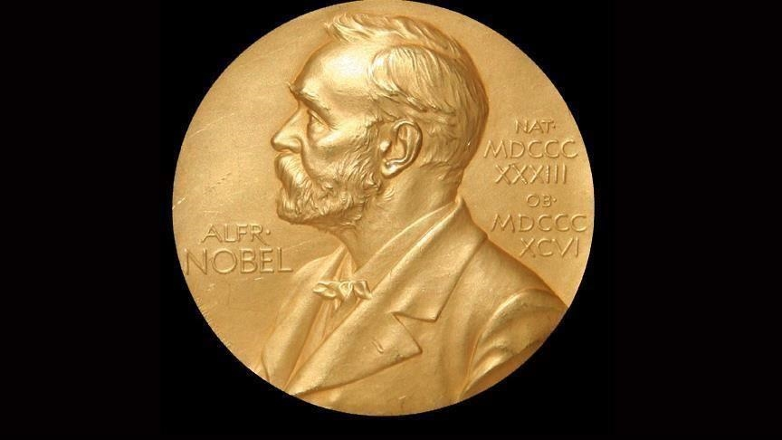

La base de données 'Nobel Laureate Publications' est extraite du projet *TidyTuesday* disponible sur le site *GitHub*.
Les données ont été recueilli par Georgios Karamanis qui s'est appuyer sur différents sites internets tels que la page officiel du prix nobel, celui des universités etc.

Elle resence le nom du lauréat et des informations le concernant, le domaine, ainsi que le nombre de publi etc
Ainsi presque tous les prix nobels datant de 1900 à 2016 on été résencés (545 sur 590)


```{r setup, message=FALSE, warning=FALSE, echo=FALSE}
library(tidyverse)
library(skimr)
library(knitr)
library(kableExtra)

```
```{r message=FALSE, warning=FALSE, echo=FALSE}

nobel_winners <- readr::read_csv("https://raw.githubusercontent.com/rfordatascience/tidytuesday/master/data/2019/2019-05-14/nobel_winners.csv")

nobel_winner_all_pubs <- readr::read_csv("https://raw.githubusercontent.com/rfordatascience/tidytuesday/master/data/2019/2019-05-14/nobel_winner_all_pubs.csv")

```

Dans un soucis de simplification de la base de données et de son analyse, j'ai fait le choix de supprimer les prix nobel de la paix. En effet, j'obtiens de nombreuses valeurs manquantes et de plus, le fait que des organisations ont parfois été récompensées, rendent notre analyse plus complexe.
```{r}
nobel_winners_no_peace <- nobel_winners[!nobel_winners$category=="Peace", ]
```
A partir de maintenant nous avons 839 observation et 18 variables.


Idée de question

1. combien de pays on gagné le prix nobel

3. plusieurs fois eu un prix ?
4. répartition par continent
6. nombre de publication avant d'avoir un prix?
7. nb ind seul à obtenir le prix et non un travail de groupe? graphe de 1 , 2 , 3 , 4 , 5 , et plus
 est ce que le nombre de publication a un impact sur la probabilité d'avoir un prix?


## **Questions**

#### **Combien de femmes ont gagné un prix nobel?**
```{r}
count(nobel_winners_no_peace, nobel_winners_no_peace$gender == 'Female')
```

#### **Qu'est-ce que cela représente par rapport aux hommes?**

```{r}
nobel_winners_no_peace %>% 
  select(gender) %>% 
  ggplot()+
  aes(x = gender, fill = gender)+
  geom_bar()+
  labs(title = "Nombre de prix obtenus en fonction du genre" )+
  annotate("text", x = 1, y = 59, label = 34, color = 'black')+
  annotate("text", x = 2, y = 829, label = 805, color = 'black')+
  theme_classic()
```


