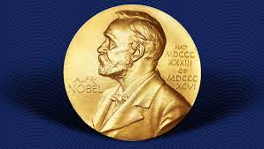

{width = 100%}


```{r setup, message=FALSE, warning=FALSE, echo=FALSE}
library(tidyverse)
library(skimr)
library(knitr)
library(kableExtra)


nobel_winners <- readr::read_csv("https://raw.githubusercontent.com/rfordatascience/tidytuesday/master/data/2019/2019-05-14/nobel_winners.csv")

nobel_winner_all_pubs <- readr::read_csv("https://raw.githubusercontent.com/rfordatascience/tidytuesday/master/data/2019/2019-05-14/nobel_winner_all_pubs.csv")
```

